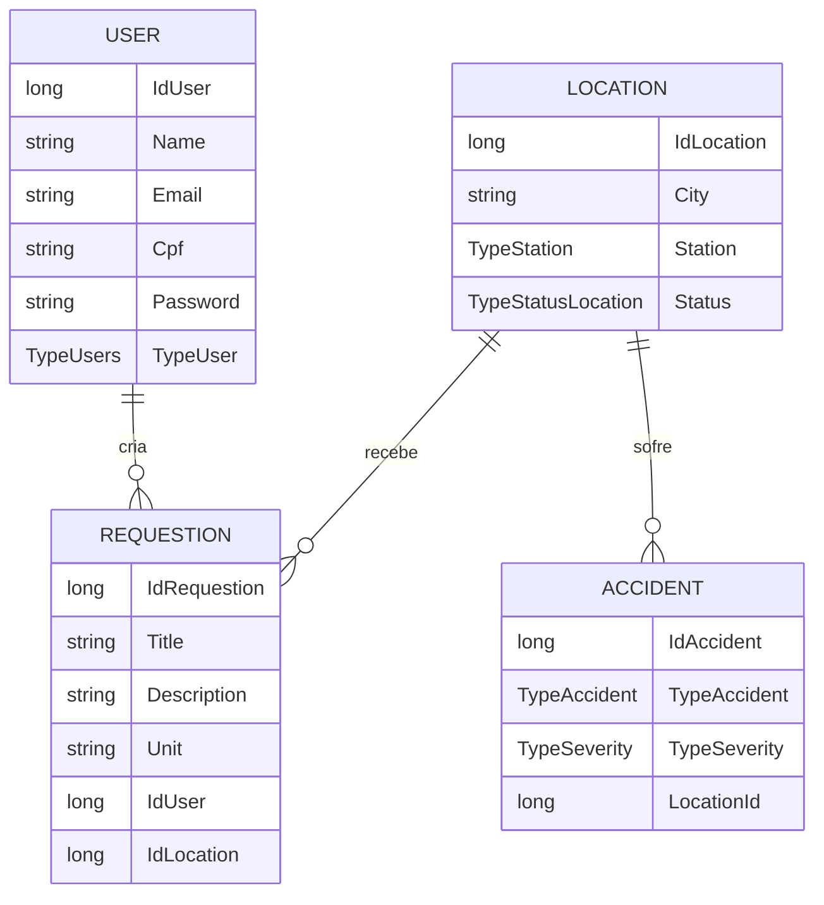

<div align="center">

# 🌍 Projeto Gaia

**Solução desenvolvida para a Global Solution 2025/1 da FIAP**

</div>

<div align="center">
  
  
  
  
</div>

---

## 📖 Tabela de Conteúdos

- [Visão Geral](#-visão-geral)
- [🎯 Funcionalidades](#-funcionalidades)
- [🏗️ Arquitetura e Diagrama](#️-arquitetura-e-diagrama)
- [🛠️ Tecnologias Utilizadas](#️-tecnologias-utilizadas)
- [🚀 Como Executar](#-como-executar)
- [📄 Endpoints da API (Exemplos)](#-endpoints-da-api-exemplos)
- [👥 Equipe do Projeto](#-equipe-do-projeto)
- [🎥 Vídeos do Projeto](#-vídeos-do-projeto)

---

## 🔭 Visão Geral

O **Projeto Gaia** nasceu do desafio da FIAP de usar a tecnologia para enfrentar **Eventos Extremos**. Nossa solução é uma API REST robusta, construída em .NET 8, projetada para ser o backend de um sistema de monitoramento e resposta a desastres. Ela permite que organizações e voluntários cadastrem locais de risco, registrem acidentes (como enchentes e deslizamentos), e gerenciem pedidos de ajuda, centralizando informações cruciais para salvar vidas e otimizar o envio de recursos.

---

## 🎯 Funcionalidades

-   ✅ **Gerenciamento de Usuários:** CRUD completo para cadastrar, consultar, atualizar e remover usuários (voluntários, administradores).
-   ✅ **Mapeamento de Localidades:** Permite o registro de cidades e estados em situação de risco ou sob monitoramento.
-   ✅ **Registro de Acidentes:** Cadastro de diferentes tipos de desastres (enchentes, deslizamentos, etc.), associando-os a uma localidade e a um nível de severidade.
-   ✅ **Central de Requisições:** Criação de pedidos de ajuda (água, alimentos, etc.) vinculados a um usuário e a uma localidade necessitada.
-   ✅ **Documentação Interativa:** A API é 100% documentada com Swagger, permitindo testar todos os endpoints diretamente pelo navegador.

---

## 🏗️ Arquitetura e Diagrama

A API foi construída em .NET 8 seguindo uma arquitetura limpa e organizada para garantir manutenibilidade e escalabilidade.

-   **Controllers:** Camada responsável por expor os endpoints da API (`/api/user`, `/api/location`, etc.) e gerenciar as requisições HTTP.
-   **Services:** Camada que contém toda a lógica de negócio da aplicação, orquestrando as operações e validações.
-   **Domain (Entities & Enums):** Coração do sistema, onde as entidades de negócio (`User`, `Accident`, etc.) e os enums (`TypeSeverity`, `TypeAccident`, etc.) são definidos.
-   **Infrastructure (Context & Mappings):** Camada de acesso a dados, responsável pela configuração do Entity Framework Core, mapeamento das entidades para o banco de dados Oracle e persistência dos dados.

#### Diagrama de Entidade-Relacionamento (DER)

Este diagrama mostra como as principais entidades do sistema se conectam.



---

## 🛠️ Tecnologias Utilizadas

| Tecnologia | Finalidade |
| :--- | :--- |
| **.NET 8** | Framework principal para a construção da API. |
| **ASP.NET Core** | Para criação de aplicações web e APIs REST. |
| **Entity Framework Core** | ORM para mapeamento e persistência de dados no Oracle. |
| **Oracle Database** | Banco de dados relacional para armazenamento dos dados. |
| **Swagger (OpenAPI)** | Documentação interativa e testes da API. |
| **C# 12** | Linguagem de programação principal do projeto. |

---

## 🚀 Como Executar

Siga os passos abaixo para executar a API em seu ambiente local.

**Pré-requisitos:**
* [.NET 8 SDK](https://dotnet.microsoft.com/download/dotnet/8.0)
* Um servidor de banco de dados Oracle acessível.
* Um editor de código de sua preferência (ex: VS Code, JetBrains Rider).

**1. Clone o Repositório**
```bash
git clone [https://github.com/SEU-USUARIO/SEU-REPOSITORIO.git](https://github.com/SEU-USUARIO/SEU-REPOSITORIO.git)
cd SEU-REPOSITORIO
```

**2. Configure a Conexão com o Banco**
Abra o arquivo `Gaia/appsettings.json` e altere a `DefaultConnection` com os dados do seu banco Oracle.
```json
"ConnectionStrings": {
  "DefaultConnection": "Data Source=oracle.fiap.com.br:1521/orcl;User ID=SEU_RM;Password=SUA_SENHA;"
}
```

**3. Execute as Migrations**
Para criar a estrutura de tabelas no banco, execute o seguinte comando no terminal, dentro da pasta `Gaia`:
```bash
dotnet ef database update
```

**4. Inicie a Aplicação**
```bash
dotnet run --project Gaia
```

---

## 📄 Endpoints da API (Exemplos)

Use os exemplos abaixo para testar a criação de recursos no Swagger.

<details>
<summary><b>POST /api/User - Criar um novo usuário</b></summary>

**Request Body:**
```json
{
  "name": "João da Silva",
  "email": "joao.silva@example.com",
  "password": "SenhaForte123!",
  "cpf": "12345678901",
  "typeUser": "Admin",
  "requestions": []
}
```
</details>

<details>
<summary><b>POST /api/Location - Criar uma nova localização</b></summary>

**Request Body:**
```json
{
  "idLocation": 0,
  "city": "string",
  "startAccident": "2025-06-03T13:58:12.987Z",
  "endAccident": "2025-06-03T13:58:12.987Z",
  "status": "BOM",
  "station": "AC",
  "requestions": [],
  "accidents": []
}
```
</details>

<details>
<summary><b>POST /api/Accident - Registrar um novo acidente</b></summary>

**Request Body:**
```json
{
  "dateAccidentStart": "2025-06-02T20:19:22.124Z",
  "dateAccidentEnd": "2025-06-02T20:19:22.124Z",
  "typeSeverity": "BAIXA",
  "typeAccident": "ENCHENTE",
  "locationId": 2
}
```
</details>

<details>
<summary><b>POST /api/Requestion - Criar uma nova requisição de ajuda</b></summary>

**Request Body:**
```json
{
  "idRequestion": 0,
  "title": "Nova Solicitação",
  "description": "Descrição teste",
  "unit": "Kg",
  "requestDate": "2025-06-03T16:35:00.614Z",
  "idUser": 3,
  "idLocation": 3
}
```
</details>

---

## 👥 Equipe do Projeto

| Nome Completo | RM | Turma |
| :--- | :---: | :---: |
| Luiz Eduardo Da Silva Pinto | 555213 | 2TDSPM |
| Eduardo Augusto Pelegrino Einsfeldt | 556460 | 2TDSPM |
| Murillo Ari Ferreira Sant'Anna | 557183 | 2TDSPM |

---

## 🎥 Vídeos do Projeto

-   **[Pitch](https://youtu.be/JuaJ-MDg9nc)**
-   **[Assista à Demonstração Completa (8 min)](https://youtu.be/WYma64qzMrI)**

